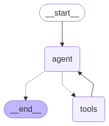
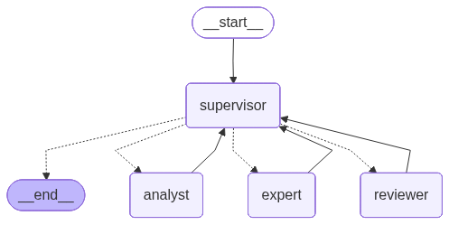

# 🤖 Agentic AI Projects

Welcome to my **Agentic AI Showcase** 🚀  
This repository highlights some of my AI agent projects, each demonstrating different capabilities of orchestration, reasoning, and automation.  
For every project, I’ll include a **demo image or architecture diagram** to make the concepts more visual and engaging.

---

## 📌 Projects

### 1. SQL Querying Agent

The **SQL Querying Agent** bridges natural language and databases.  
- **Goal**: Allow users to query structured databases using plain English.  
- **Workflow**:
  - Parse the database schema.
  - Convert natural language queries into **SQL statements**.
  - Execute queries and return results in a user-friendly format.  
- **Tech stack**: LLMs, SQLAlchemy/DB connectors, LangChain-style orchestration.  

✅ *Example*: Ask *“What are the top 5 customers by revenue this year?”* → Agent generates and executes the SQL query, then outputs results.

---

### 2. Multi-Agent Architecture System

The **Multi-Agent Architecture System** demonstrates an orchestrated workflow of specialized agents.  
- **Supervisor Agent** manages roles:
  1. **Analyst** – explores schema and generates meaningful questions.  
  2. **Expert** – converts queries into SQL, executes them, and provides detailed answers.  
  3. **Reviewer** – summarizes answers into structured **PDF reports**.  
- **Process**:
  - Analyst → Expert → Reviewer → END.  
- **Outcome**: A fully automated pipeline where human-like agents collaborate to turn raw data into **insightful business reports**.  

✅ *Example*: Input a schema → Analyst generates 3 questions → Expert answers with SQL execution → Reviewer compiles results into a polished PDF report.

---

## 🛠️ Tech Stack
- **Languages**: Python  
- **Frameworks**: LangChain, OpenAI API, Streamlit (for demos)  
- **Tools**: SQLAlchemy, Pandas, ReportLab/Fpdf, Jupyter Notebooks  

---

## 🚀 Next Steps
- Add more project demos.  
- Upload execution flow images & architecture diagrams.  
- Include sample datasets and query results for reproducibility.  

---

## 📄 License
MIT License – free to use and modify. Contributions welcome!
